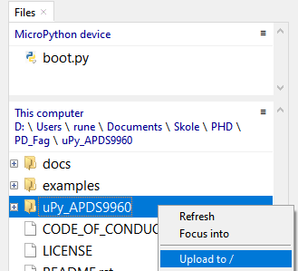
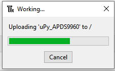

Thonny IDE Turorial
===================

This is a short visual tutorial on how to use the `Thonny IDE <http://thonny.org/>`_  to flash the ESP8266 chip and upload and test the uPy_APDS9960 library

Download and install
--------------------
The latest version of tonny can be found at `thonny.org <http://thonny.org/>`_ 

In this tutorial we uses the `windows version <https://github.com/thonny/thonny/releases/download/v3.2.4/thonny-3.2.4.exe>`_
and install Thonny on your computer

Download up Micropython (ESP8266) dev enviroment
~~~~~~~~~~~~~~~~~~~~~~~~~~~~~~~~~~~~~~~~~~~~~~~~

Download latest `MicroPython firmware for ESP8266 <http://micropython.org/download#esp8266>`_

Start Thonny
------------

.. image:: images/thonny/WindowsCmd.png
  :alt: Windows comand prompt showing Thonny 

Flash new firmware
------------------

Installing esptool.py
~~~~~~~~~~~~~~~~~~~~~
From the menu "Tools" select "Manage Plut-ins..."

.. image:: images/thonny/Manage_Plugins.PNG
  :alt: Manage Plut-ins... 

In the text field enter "esptool" and click the button "Find packages from PyPI"

.. image:: images/thonny/install_esptool.png
  :alt: Install esptool from PyPI... 

Click the "Install" button to finish the esptool installation

Seting up Micropython (ESP8266) dev enviroment
~~~~~~~~~~~~~~~~~~~~~~~~~~~~~~~~~~~~~~~~~~~~~~

From the menu "Run" select "Select intepreter..."

.. image:: images/thonny/select_intep.png
  :alt: Select python intepreter to ESP8266

The ESP8266 firmware install/upgrade dialog is shown

.. image:: images/thonny/ESP8266_FirmwareUp_Box1.png
  :alt: Shows ESP8266 firmware options dialog

Make sure thet the ESP8266 development kit is connected.
Select the "port dropdown" arrow to select the serial port for flashing the ESP8266.

In the "Firmware" text field select the .bin file that was `downloaded <http://micropython.org/download#esp8266>`_ and click the install button

.. image:: images/thonny/ESP8266_FirmwareUp_Box3.PNG
  :alt: Shows ESP8266 firmware options dialog

Click the stop icon to reset and connect to the ESP8266 board

Now you should be up and running as shown in the thonny shell windows

Running the examples
--------------------

Start by uploadting the uPy_APDS9960 library.

Uploading uPy_APDS9960
~~~~~~~~~~~~~~~~~~~~~~

From the files windows under "This computer" right click on the folder "uPy_APDS9960" and from the dropdown menu select "Upload to /" 

ESP8266 Tutorial
~~~~~~~~~~~~~~~~~~~~~~~~~

Now you are ready to have fun with the ESP8266

Pins and GPIO
-------------

Use the :ref:`machine.Pin <machine.Pin>` class::

    from machine import Pin

    p0 = Pin(0, Pin.OUT)    # create output pin on GPIO0
    p0.on()                 # set pin to "on" (high) level
    p0.off()                # set pin to "off" (low) level
    p0.value(1)             # set pin to on/high

    p2 = Pin(2, Pin.IN)     # create input pin on GPIO2
    print(p2.value())       # get value, 0 or 1

    p4 = Pin(4, Pin.IN, Pin.PULL_UP) # enable internal pull-up resistor
    p5 = Pin(5, Pin.OUT, value=1) # set pin high on creation

Available pins are: 0, 1, 2, 3, 4, 5, 12, 13, 14, 15, 16, which correspond
to the actual GPIO pin numbers of ESP8266 chip. Note that many end-user
boards use their own adhoc pin numbering (marked e.g. D0, D1, ...). As
MicroPython supports different boards and modules, physical pin numbering
was chosen as the lowest common denominator. For mapping between board
logical pins and physical chip pins, consult your board documentation.

Note that Pin(1) and Pin(3) are REPL UART TX and RX respectively.
Also note that Pin(16) is a special pin (used for wakeup from deepsleep
mode) and may be not available for use with higher-level classes like
``Neopixel``.

PWM (pulse width modulation)
----------------------------

PWM can be enabled on all pins except Pin(16).  There is a single frequency
for all channels, with range between 1 and 1000 (measured in Hz).  The duty
cycle is between 0 and 1023 inclusive.

Use the ``machine.PWM`` class::

    from machine import Pin, PWM

    pwm0 = PWM(Pin(0))      # create PWM object from a pin
    pwm0.freq()             # get current frequency
    pwm0.freq(1000)         # set frequency
    pwm0.duty()             # get current duty cycle
    pwm0.duty(200)          # set duty cycle
    pwm0.deinit()           # turn off PWM on the pin

    pwm2 = PWM(Pin(2), freq=500, duty=512) # create and configure in one go

Delay and timing
----------------

Use the :mod:`time <utime>` module::

    import time

    time.sleep(1)           # sleep for 1 second
    time.sleep_ms(500)      # sleep for 500 milliseconds
    time.sleep_us(10)       # sleep for 10 microseconds
    start = time.ticks_ms() # get millisecond counter
    delta = time.ticks_diff(time.ticks_ms(), start) # compute time difference

Timers
------

Virtual (RTOS-based) timers are supported. Use the :ref:`machine.Timer <machine.Timer>` class
with timer ID of -1::

    from machine import Timer

    tim = Timer(-1)
    tim.init(period=5000, mode=Timer.ONE_SHOT, callback=lambda t:print(1))
    tim.init(period=2000, mode=Timer.PERIODIC, callback=lambda t:print(2))

The period is in milliseconds.

