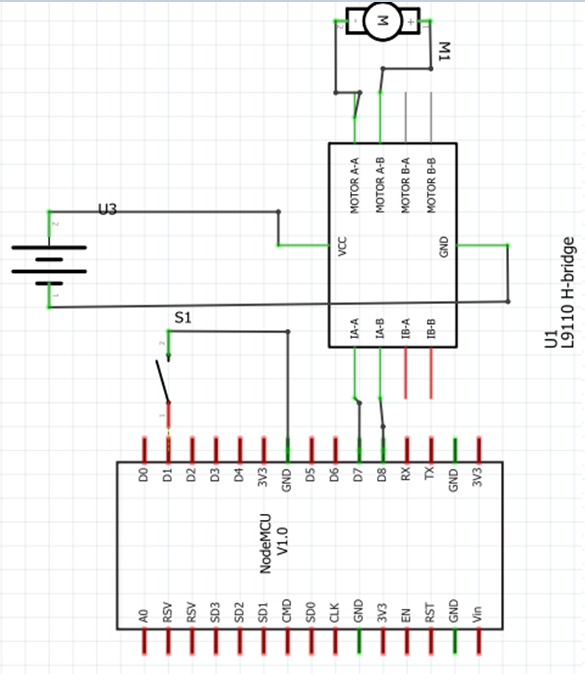

Thonny IDE Turorial
===================

This is a short visual tutorial on how to use the `Thonny IDE <http://thonny.org/>`_  to flash the ESP8266 chip and upload and test the uPy_APDS9960 library

Download and install
--------------------
The latest version of tonny can be found at `thonny.org <http://thonny.org/>`_ 

In this tutorial we uses the `windows version <https://github.com/thonny/thonny/releases/download/v3.2.4/thonny-3.2.4.exe>`_
and install Thonny on your computer

Download up Micropython (ESP8266) dev enviroment
~~~~~~~~~~~~~~~~~~~~~~~~~~~~~~~~~~~~~~~~~~~~~~~~

Download latest `MicroPython firmware for ESP8266 <http://micropython.org/download#esp8266>`_

Start Thonny
------------

.. image:: images/thonny/WindowsCmd.png
  :alt: Windows comand prompt showing Thonny 

Flash new firmware
------------------

Installing esptool.py
~~~~~~~~~~~~~~~~~~~~~
From the menu "Tools" select "Manage Plut-ins..."

.. image:: images/thonny/Manage_Plugins.PNG
  :alt: Manage Plut-ins... 

In the text field enter "esptool" and click the button "Find packages from PyPI"

Click the "Install" button to finish the esptool installation

Seting up Micropython (ESP8266) dev enviroment
~~~~~~~~~~~~~~~~~~~~~~~~~~~~~~~~~~~~~~~~~~~~~~

From the menu "Run" select "Select intepreter..."

The ESP8266 firmware install/upgrade dialog is shown

Make sure thet the ESP8266 development kit is connected.
Select the "port dropdown" arrow to select the serial port for flashing the ESP8266.

.. image:: images/thonny/ESP8266_FirmwareUp_Box2.png
  :alt: Shows ESP8266 firmware options dialog

In the "Firmware" text field select the .bin file that was `downloaded <http://micropython.org/download#esp8266>`_ and click the install button

Click the stop icon to reset and connect to the ESP8266 board

.. image:: images/thonny/RestartESP8266.PNG
  :alt: Shows ESP8266 software reset

Now you should be up and running as shown in the thonny shell windows

.. image:: images/thonny/ESP8266Shell.PNG
  :alt: ESP8266 terminal window

Running the examples
--------------------

Now you are ready to run MicroPython programs on the ESP8266 :)

ESP8266 Tutorial
--------------------

Now you are ready to have fun with the ESP8266

Output Pins and GPIO 
--------------------
::

    from machine import Pin

    lRedC  = Pin(15, Pin.OUT)    # Rød LED Catode (-)
    lRedA  = Pin(13, Pin.OUT)    # Rød LED Anode  (+)
    lBlueC = Pin(12, Pin.OUT)    # Blå LED Catode (-)
    lBlueA = Pin(14, Pin.OUT)    # Blå LED Anode  (+)

    lRedA.on()         # set pin to "on" (high) level
    lRedC.off()        # set pin to "off" (low) level
    
    lBlueA.on()        # set pin to "on" (high) level
    lBlueC.off()       # set pin to "off" (low) level

    lRedC.value(1)     # set pin to on/high
    lRedC.value(1)     # set pin to on/high

Input Pins and GPIO 
--------------------

::

    from machine import Pin
    p5 = Pin(5, Pin.IN,Pin.PULL_UP)     # create input pin on GPIO5  enable internal pull-up resistor
    print(p5.value())                   # get value, 0 or 1

PWM (pulse width modulation)
----------------------------

PWM can be enabled on all pins except Pin(16).  There is a single frequency
for all channels, with range between 1 and 1000 (measured in Hz).  The duty
cycle is between 0 and 1023 inclusive.

Use the ``machine.PWM`` class::

    from machine import Pin, PWM

    lRedC  = Pin(15, Pin.OUT)    # Rød LED Catode (-)
    lRedC.off()                  # set pin to "off" (low) level

    pwm0 = PWM(Pin(13))     # create PWM object on Rød LED Anode  (+)
    pwm0.duty(200)          # set duty cycle

Delay and timing
----------------

Use the :mod:`time <utime>` module::

    import time

    time.sleep(1)           # sleep for 1 second
    time.sleep_ms(500)      # sleep for 500 milliseconds
    time.sleep_us(10)       # sleep for 10 microseconds
    start = time.ticks_ms() # get millisecond counter
    delta = time.ticks_diff(time.ticks_ms(), start) # compute time difference

Timers
------

Virtual (RTOS-based) timers are supported. Use the :ref:`machine.Timer <machine.Timer>` class
with timer ID of -1::

    from machine import Timer

    tim = Timer(-1)
    tim.init(period=5000, mode=Timer.ONE_SHOT, callback=lambda t:print(1))
    tim.init(period=2000, mode=Timer.PERIODIC, callback=lambda t:print(2))

The period is in milliseconds.

Timer Blink example
-------------------

::

  from machine import Timer, Pin
  import time

  #Define a function to blink a LED
  def blink(led):
       led.value(not led.value())
       

  lRedGnd = Pin(15, Pin.OUT)  # Rød LED Catode (-)
  lRedGnd.off()               # set pin to "off" (low) level

  lRedOn  = Pin(13, Pin.OUT)  # Rød LED Anode  (+)

  #Construct a virtual (id=-1) timer
  blinkTimer = Timer(-1)
  #Setup the timer to call the custom blink function at a regular interval of 0.5 second
  blinkTimer.init(period=500, mode=Timer.PERIODIC, callback=lambda t:blink(lRedOn))

GPIO IRQ
--------
::

  from machine import Pin

  #Define a function to blink a LED
  def blink(led):
       led.value(not led.value())

  lRedA  = Pin(13, Pin.OUT)    # Rød LED Anode  (+)
  lRedC  = Pin(15, Pin.OUT)    # Rød LED Catode (-)
  lRedC.off()                  # set pin to "off" (low) level

  d1 = Pin(5, Pin.IN,Pin.PULL_UP)     # create input pin on GPIO5  enable internal pull-up resistor
  d1.irq(trigger=Pin.IRQ_RISING | Pin.IRQ_FALLING, handler=lambda t:blink(lRedA))

Motor og bryter eksempel
--------------------------
.. image:: images/thonny/MotorHBruCon.png

::

  from machine import Pin

  MotorAA  = Pin(15, Pin.OUT)    # Motor A's inngang A
  MotorAB  = Pin(13, Pin.OUT)    # Motor A's inngang B

  RetningsBryter = Pin(5, Pin.IN,Pin.PULL_UP)     # create input D1
  print(RetningsBryter.value())                   # get value, 0 or 1

  while(True): 

      if (RetningsBryter.value() == 1):  # Skjekk om motor skal rotere til Venstre
          # Sørg for at moror roterer til venstre    
          MotorAA.on()
          MotorAB.off()

      if (RetningsBryter.value() == 0):  # Skjekk om motor skal rotere til Høyre
          # Starter med at moror roterer til høyre
          MotorAA.off()
          MotorAB.on()

